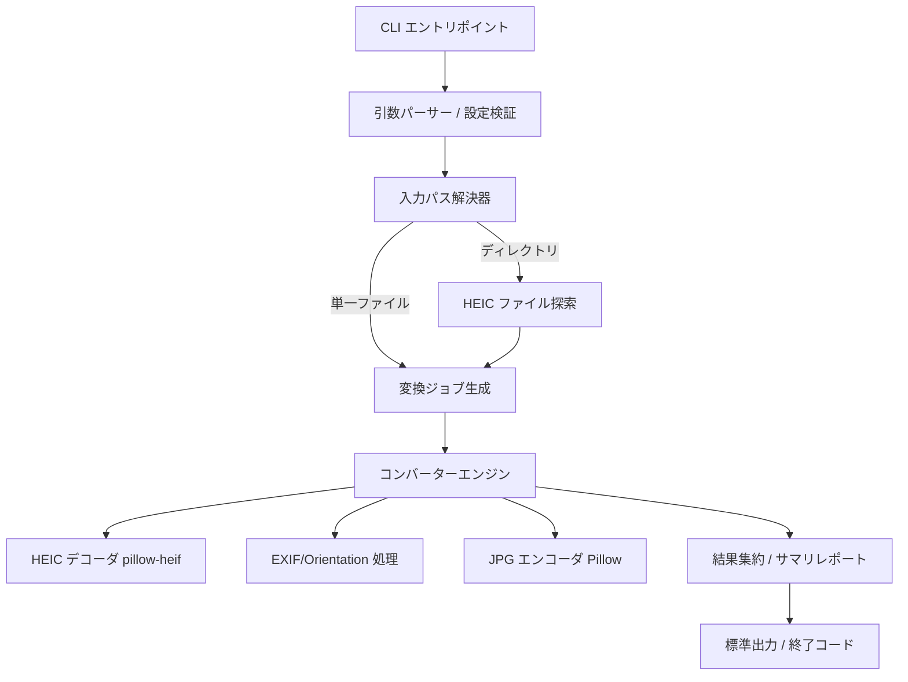
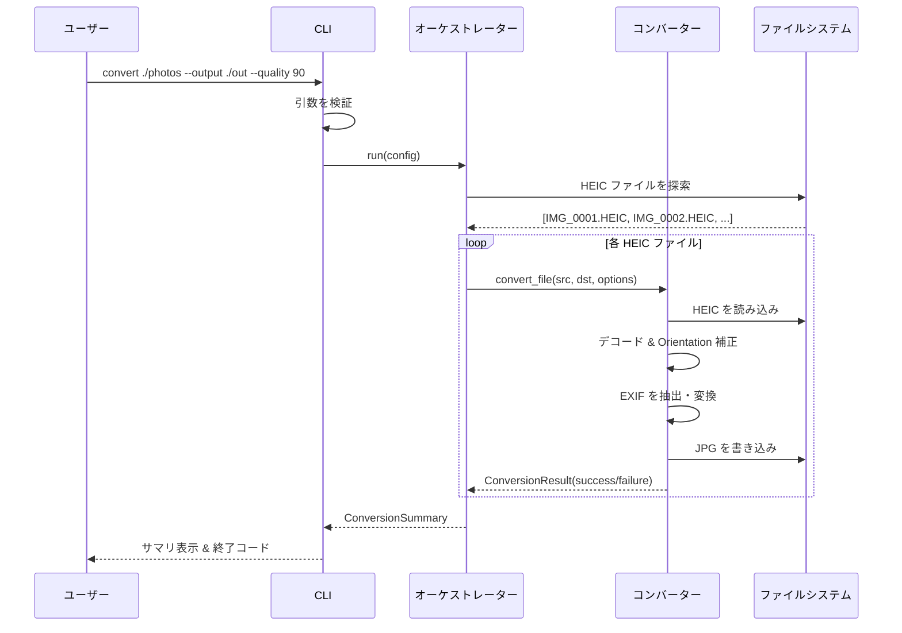

# 設計ドキュメント: HEIC to JPG コンバーター

## Overview

本機能は、iOSデバイスで撮影された HEIC/HEIF 形式の画像を JPG 形式に変換する Python プログラムです。単一ファイルおよびディレクトリ単位での一括変換をサポートし、コマンドラインインターフェース (CLI) から操作します。

変換処理には `pillow-heif` (HEIC デコード) と `Pillow` (画像処理・JPG エンコード) を利用します。iOS 特有の EXIF メタデータ（撮影日時、GPS、Orientation など）を可能な限り保持し、画像の向き (Orientation) を正しく反映した状態で出力します。

大量の画像を扱うケースを想定し、逐次処理による進捗表示、既存ファイルの上書き制御、エラーが発生しても処理を継続する堅牢性を備えます。

## Architecture



### レイヤー構成

- **CLI レイヤー**: 引数の解析と検証、ユーザーへの出力を担当。
- **オーケストレーションレイヤー**: 入力パスの解決、変換対象ファイルの列挙、ジョブの実行制御。
- **コンバーターレイヤー**: 1ファイル分の HEIC → JPG 変換ロジック（デコード、Orientation 補正、EXIF 保持、エンコード）。
- **結果レイヤー**: 各ジョブの成功/失敗を集約し、サマリを生成。

## Sequence Diagram (シーケンス図)

### メインフロー: ディレクトリ一括変換



## Components and Interfaces

### コンポーネント 1: CLI (`cli.py`)

**目的**: コマンドライン引数を解析し、設定オブジェクトを構築して変換処理を起動する。

**インターフェース**:
```python
def main(argv: list[str] | None = None) -> int:
    """CLI エントリポイント。終了コードを返す (0=成功, 1=一部失敗, 2=引数エラー)。"""

def parse_args(argv: list[str]) -> ConversionConfig:
    """コマンドライン引数を ConversionConfig に変換する。"""
```

**責務**:
- 引数の解析と検証
- サマリ結果の標準出力への表示
- 適切な終了コードの返却

### コンポーネント 2: オーケストレーター (`orchestrator.py`)

**目的**: 入力パスを解決し、変換対象ファイルを列挙し、各ジョブを実行して結果を集約する。

**インターフェース**:
```python
def run(config: ConversionConfig) -> ConversionSummary:
    """設定に基づき変換を実行し、集約結果を返す。"""

def discover_heic_files(path: Path, recursive: bool) -> list[Path]:
    """指定パス配下の HEIC/HEIF ファイルを列挙する。"""

def resolve_output_path(src: Path, config: ConversionConfig) -> Path:
    """入力ファイルに対する出力 JPG パスを決定する。"""
```

**責務**:
- 単一ファイル / ディレクトリの判別
- HEIC ファイルの探索（拡張子フィルタ）
- 出力パスの決定と上書きポリシーの適用
- 各ファイルの変換呼び出しと結果集約

### コンポーネント 3: コンバーター (`converter.py`)

**目的**: 1つの HEIC ファイルを JPG に変換するコアロジック。

**インターフェース**:
```python
def convert_file(src: Path, dst: Path, options: ConversionOptions) -> ConversionResult:
    """単一の HEIC ファイルを JPG に変換する。"""

def load_heic(src: Path) -> Image.Image:
    """HEIC ファイルを Pillow Image として読み込む。"""

def apply_orientation(image: Image.Image) -> Image.Image:
    """EXIF Orientation に従って画像を正立させる。"""

def extract_exif(image: Image.Image) -> bytes | None:
    """保持すべき EXIF メタデータを抽出する。"""
```

**責務**:
- HEIC のデコード
- Orientation 補正
- EXIF メタデータの保持
- JPG エンコード（品質指定）

## Data Models

### モデル 1: ConversionConfig

```python
from dataclasses import dataclass
from pathlib import Path

@dataclass(frozen=True)
class ConversionConfig:
    input_path: Path           # 入力ファイルまたはディレクトリ
    output_dir: Path | None    # 出力先ディレクトリ (None なら入力と同じ場所)
    quality: int               # JPG 品質 (1-100)
    recursive: bool            # ディレクトリを再帰的に探索するか
    overwrite: bool            # 既存 JPG を上書きするか
    keep_metadata: bool        # EXIF メタデータを保持するか
```

**検証ルール**:
- `input_path` は存在するパスでなければならない。
- `quality` は 1 以上 100 以下の整数。
- `output_dir` が指定された場合、作成可能なパスであること。

### モデル 2: ConversionOptions

```python
@dataclass(frozen=True)
class ConversionOptions:
    quality: int           # JPG 品質 (1-100)
    keep_metadata: bool    # EXIF を保持するか
    overwrite: bool        # 上書き可否
```

**検証ルール**:
- `quality` は 1〜100 の範囲。

### モデル 3: ConversionResult

```python
from enum import Enum

class ResultStatus(Enum):
    SUCCESS = "success"
    SKIPPED = "skipped"      # 上書き禁止で既存ファイルをスキップ
    FAILED = "failed"

@dataclass(frozen=True)
class ConversionResult:
    src: Path
    dst: Path | None
    status: ResultStatus
    error_message: str | None = None
```

### モデル 4: ConversionSummary

```python
@dataclass(frozen=True)
class ConversionSummary:
    results: list[ConversionResult]

    @property
    def succeeded(self) -> int: ...
    @property
    def skipped(self) -> int: ...
    @property
    def failed(self) -> int: ...
    @property
    def exit_code(self) -> int:
        """全成功=0, 一部失敗=1。"""
```

## Algorithmic Pseudocode (アルゴリズム擬似コード)

### メイン変換ワークフロー

```pascal
ALGORITHM run(config)
INPUT: config of type ConversionConfig
OUTPUT: summary of type ConversionSummary

BEGIN
  ASSERT config.input_path が存在する
  ASSERT 1 <= config.quality <= 100

  // Step 1: 変換対象ファイルの決定
  IF config.input_path はファイル THEN
    files ← [config.input_path]
  ELSE
    files ← discover_heic_files(config.input_path, config.recursive)
  END IF

  results ← 空リスト
  options ← ConversionOptions(config.quality, config.keep_metadata, config.overwrite)

  // Step 2: 各ファイルを変換（ループ不変条件付き）
  FOR each src IN files DO
    ASSERT results 内のすべての要素は処理済みで有効な ConversionResult

    dst ← resolve_output_path(src, config)

    IF ファイル dst が存在する AND NOT config.overwrite THEN
      result ← ConversionResult(src, dst, SKIPPED)
    ELSE
      TRY
        result ← convert_file(src, dst, options)
      CATCH error
        result ← ConversionResult(src, NULL, FAILED, error.message)
      END TRY
    END IF

    results.append(result)
  END FOR

  // Step 3: 結果集約
  summary ← ConversionSummary(results)

  ASSERT length(summary.results) = length(files)
  RETURN summary
END
```

**事前条件 (Preconditions)**:
- `config.input_path` が実在する。
- `config.quality` が 1〜100 の範囲。

**事後条件 (Postconditions)**:
- `summary.results` の要素数は変換対象ファイル数と一致する。
- 各結果は SUCCESS / SKIPPED / FAILED のいずれかのステータスを持つ。
- いずれか1件が失敗しても処理は全ファイルに対して継続される。

**ループ不変条件 (Loop Invariants)**:
- ループの各反復開始時、`results` はそれまでに処理したファイルの結果のみを含み、すべて有効。
- 未処理ファイルは `results` に含まれない。

### 単一ファイル変換アルゴリズム

```pascal
ALGORITHM convert_file(src, dst, options)
INPUT: src (HEIC パス), dst (JPG パス), options of type ConversionOptions
OUTPUT: result of type ConversionResult

BEGIN
  ASSERT src が存在し、HEIC/HEIF 形式である
  ASSERT 1 <= options.quality <= 100

  // Step 1: デコード
  image ← load_heic(src)

  // Step 2: Orientation 補正
  image ← apply_orientation(image)

  // Step 3: カラーモード正規化 (JPG は RGB のみ対応)
  IF image.mode NOT IN {"RGB", "L"} THEN
    image ← image.convert("RGB")
  END IF

  // Step 4: EXIF 抽出
  IF options.keep_metadata THEN
    exif ← extract_exif(image)
  ELSE
    exif ← NULL
  END IF

  // Step 5: 出力先ディレクトリを確保
  ensure_parent_directory(dst)

  // Step 6: JPG エンコード
  IF exif IS NOT NULL THEN
    image.save(dst, format="JPEG", quality=options.quality, exif=exif)
  ELSE
    image.save(dst, format="JPEG", quality=options.quality)
  END IF

  ASSERT dst が存在する
  RETURN ConversionResult(src, dst, SUCCESS)
END
```

**事前条件 (Preconditions)**:
- `src` が実在し、読み取り可能な HEIC/HEIF ファイル。
- `options.quality` が有効範囲内。

**事後条件 (Postconditions)**:
- 成功時、`dst` に有効な JPG ファイルが生成される。
- 出力画像は Orientation が補正済みで正立している。
- `keep_metadata=True` の場合、抽出可能な EXIF が出力に埋め込まれる。
- 入力ファイル `src` は変更されない（副作用なし）。

**ループ不変条件**: N/A（ループなし）

### 出力パス解決アルゴリズム

```pascal
ALGORITHM resolve_output_path(src, config)
INPUT: src (HEIC パス), config of type ConversionConfig
OUTPUT: dst (JPG パス)

BEGIN
  base_name ← src の拡張子を ".jpg" に置換したファイル名

  IF config.output_dir IS NULL THEN
    dst ← src と同じディレクトリ / base_name
  ELSE IF config.recursive AND config.input_path はディレクトリ THEN
    // ディレクトリ構造を出力先に保持
    rel ← src の config.input_path からの相対パス
    dst ← config.output_dir / (rel の拡張子を ".jpg" に置換)
  ELSE
    dst ← config.output_dir / base_name
  END IF

  RETURN dst
END
```

**事後条件**:
- 返される `dst` は拡張子 `.jpg` を持つ。
- 再帰モードでは入力ディレクトリ構造が出力先に反映される。

## Key Functions with Formal Specifications (主要関数と形式仕様)

### 関数 1: load_heic()

```python
def load_heic(src: Path) -> Image.Image
```

**事前条件**:
- `src` が実在し、HEIC/HEIF 形式のファイルである。
- `pillow-heif` が登録済み (`register_heif_opener()` 呼び出し済み)。

**事後条件**:
- 有効な Pillow `Image` オブジェクトを返す。
- 入力ファイルに副作用を与えない。

### 関数 2: apply_orientation()

```python
def apply_orientation(image: Image.Image) -> Image.Image
```

**事前条件**:
- `image` は有効な Pillow Image。

**事後条件**:
- EXIF Orientation タグに基づいて回転・反転された画像を返す。
- Orientation 情報がない場合は入力画像をそのまま返す。
- 返される画像のピクセル配置は視覚的に正立している。

### 関数 3: extract_exif()

```python
def extract_exif(image: Image.Image) -> bytes | None
```

**事前条件**:
- `image` は有効な Pillow Image。

**事後条件**:
- EXIF が存在すればバイト列として返す。存在しなければ `None`。
- Orientation タグは正立化後のため 1（通常）に正規化されることが望ましい。

## Example Usage (使用例)

```python
from pathlib import Path
from heic_to_jpg import ConversionConfig, run

# 例1: 単一ファイルの変換
config = ConversionConfig(
    input_path=Path("IMG_0001.HEIC"),
    output_dir=Path("./output"),
    quality=90,
    recursive=False,
    overwrite=False,
    keep_metadata=True,
)
summary = run(config)
print(f"成功: {summary.succeeded}, スキップ: {summary.skipped}, 失敗: {summary.failed}")

# 例2: ディレクトリの再帰的一括変換
config = ConversionConfig(
    input_path=Path("./photos"),
    output_dir=Path("./jpg_output"),
    quality=85,
    recursive=True,
    overwrite=True,
    keep_metadata=True,
)
summary = run(config)
exit(summary.exit_code)
```

```bash
# 例3: CLI からの実行
python -m heic_to_jpg ./photos --output ./out --quality 90 --recursive
python -m heic_to_jpg IMG_0001.HEIC          # 同じ場所に IMG_0001.jpg を生成
python -m heic_to_jpg ./photos --overwrite   # 既存 JPG を上書き
```

## Correctness Properties

### Property 1: 件数保存 (Count Preservation)

任意の変換対象ファイル集合 `F` に対し、`run(config).results` の要素数は `|F|` と等しい。
- **形式**: ∀ F. len(run(config).results) == len(F)

**Validates: Requirements 2.4, 9.2**

### Property 2: 拡張子正当性 (Output Extension Validity)

任意の成功結果 `r` について、`r.dst` の拡張子は `.jpg` である。
- **形式**: ∀ r ∈ results. r.status == SUCCESS ⟹ r.dst.suffix == ".jpg"

**Validates: Requirements 3.1**

### Property 3: 入力不変性 (Input Immutability)

任意の入力ファイル `src` について、変換前後で `src` のバイト内容は変化しない。
- **形式**: ∀ src. bytes_before(src) == bytes_after(src)

**Validates: Requirements 1.3**

### Property 4: 品質範囲 (Quality Range)

`ConversionConfig` を構築できるのは `1 <= quality <= 100` の場合に限る。
- **形式**: valid(config) ⟺ 1 <= config.quality <= 100

**Validates: Requirements 4.2, 4.3**

### Property 5: 上書き制御 (Overwrite Control)

`overwrite=False` かつ出力先が既存の場合、結果は必ず `SKIPPED` となり既存ファイルは変更されない。
- **形式**: exists(dst) ∧ ¬overwrite ⟹ result.status == SKIPPED ∧ unchanged(dst)

**Validates: Requirements 6.1**

### Property 6: 障害分離 (Failure Isolation)

あるファイルの変換が失敗しても、他のファイルの処理結果には影響しない（失敗は `FAILED` として記録され処理は継続する）。
- **形式**: ∀ i, j. i ≠ j ⟹ result(i) は result(j) の失敗に依存しない

**Validates: Requirements 7.3, 7.4**

### Property 7: Orientation 正立 (Orientation Correctness)

任意の HEIC 入力に対し、出力 JPG は視覚的に正立している（Orientation が反映済み）。
- **形式**: ∀ heic. upright(convert(heic))

**Validates: Requirements 5.3, 5.4**

### Property 8: 終了コード整合 (Exit Code Consistency)

`summary.failed > 0` のとき `exit_code == 1`、それ以外は `exit_code == 0`。
- **形式**: summary.exit_code == (1 if summary.failed > 0 else 0)

**Validates: Requirements 8.2, 8.3**

## Error Handling

### シナリオ 1: 入力ファイルが破損している / HEIC でない

**条件**: `load_heic()` がデコードに失敗する。
**対応**: 当該ファイルを `FAILED` として記録し、エラーメッセージを保持。処理は次のファイルへ継続。
**回復**: サマリで失敗ファイル一覧を報告し、ユーザーが個別に対処可能。

### シナリオ 2: 出力先が書き込み不可 / 権限エラー

**条件**: `image.save()` が `OSError` / `PermissionError` を送出。
**対応**: 当該ファイルを `FAILED` として記録。処理継続。
**回復**: サマリでエラー内容（権限・パス）を提示。

### シナリオ 3: 出力先に既存の JPG が存在する

**条件**: `dst` が既に存在し `overwrite=False`。
**対応**: `SKIPPED` として記録し、既存ファイルを保護。
**回復**: ユーザーが `--overwrite` を付けて再実行可能。

### シナリオ 4: 入力パスが存在しない / 不正な引数

**条件**: `input_path` が存在しない、または `quality` が範囲外。
**対応**: CLI が検証段階でエラーメッセージを表示し、終了コード 2 で終了。
**回復**: ユーザーが引数を修正して再実行。

### シナリオ 5: 変換対象の HEIC ファイルが1件も見つからない

**条件**: ディレクトリに HEIC/HEIF が存在しない。
**対応**: 警告メッセージを表示し、空のサマリ（終了コード 0）を返す。
**回復**: ユーザーがパスや拡張子を確認。

## Testing Strategy

### ユニットテストのアプローチ

- `resolve_output_path()`: 各種設定（output_dir あり/なし、recursive あり/なし）での出力パス生成を検証。
- `apply_orientation()`: 各 Orientation 値 (1〜8) に対する回転・反転結果を検証。
- `convert_file()`: 正常系（有効な HEIC）、異常系（破損ファイル、権限エラー）を検証。
- `ConversionSummary`: succeeded/skipped/failed のカウントと exit_code の算出を検証。
- サンプル HEIC ファイル（小さな固定画像）をテストフィクスチャとして用意。

### プロパティベーステストのアプローチ

**プロパティテストライブラリ**: `hypothesis`

- **P1 (件数保存)**: ランダムな N 件の HEIC ファイル集合に対し、結果件数が常に N であることを検証。
- **P2 (拡張子正当性)**: ランダムな入力ファイル名に対し、成功結果の `dst` が常に `.jpg` で終わることを検証。
- **P4 (品質範囲)**: ランダムな整数に対し、範囲外なら `ConversionConfig` 構築（検証）が失敗し、範囲内なら成功することを検証。
- **P5 (上書き制御)**: `overwrite=False` かつ既存ファイルありのとき、常に `SKIPPED` かつ既存内容が不変であることを検証。
- **P8 (終了コード整合)**: ランダムな結果集合に対し、failed 件数と exit_code の関係を検証。

### 統合テストのアプローチ

- 実際の iOS 由来の HEIC サンプルを用いた end-to-end 変換テスト。
- ディレクトリ再帰変換で出力構造が保持されることを検証。
- CLI 経由での実行（引数解析 → 変換 → 終了コード）を subprocess で検証。

## Performance Considerations (パフォーマンス考慮事項)

- 大量ファイルの逐次処理を基本とし、メモリ使用を抑えるため画像は1件ずつロード・解放する。
- 将来的な拡張として `concurrent.futures.ProcessPoolExecutor` による並列変換を検討可能（CPU バウンドなデコード/エンコードに有効）。本初版では逐次処理をデフォルトとする。
- 進捗表示は大量ファイル時のユーザー体験のため逐次出力する。

## Security Considerations (セキュリティ考慮事項)

- 出力パスは入力パスから決定するため、パストラバーサルを防ぐため `output_dir` 配下に正規化して書き込む。
- EXIF に含まれる GPS 等の位置情報は、`keep_metadata=False` で除去可能とし、プライバシー配慮のオプションを提供する。
- 信頼できない HEIC ファイルのデコードは `pillow-heif` (libheif) に依存するため、ライブラリを最新に保つことを推奨。

## Dependencies (依存関係)

- **Python**: 3.10 以上（`X | Y` 型ヒント、`dataclass` を使用）。
- **pillow-heif**: HEIC/HEIF のデコード（libheif バインディング）。
- **Pillow**: 画像処理と JPG エンコード。
- **標準ライブラリ**: `argparse`, `pathlib`, `dataclasses`, `enum`。
- **開発/テスト**: `pytest`, `hypothesis`。
